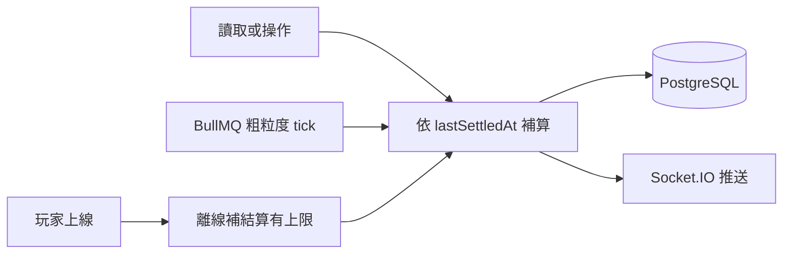

# ADR 0001：《帝國掘起》技術棧定案

| 項 | 值 |
| --- | --- |
| 編號 | 0001 |
| 版本 | 2026-10-06（補分期落地；不改定案表） |
| 狀態 | **已接受**。定案表：**確定**。分期落地：**分期** |
| 產品法源 | [系統定義 v1.0](../system-definition.md) |
| 工程切片 | [mvp.md](../mvp.md) |

## 狀態

已接受（2026-10-05）。**定案表：確定。分期落地：分期。** 2026-10-06 補「分階段落地」與離線 **8 現實小時**交叉引用（[系統定義 v1.0 §5](../system-definition.md)、[GDD 0002](../gdd/0002-time-and-settlement.md)），**不取代**本決策、**不改**定案表。離線上限數字以系統定義為準；本 ADR 只鎖定「有上限」與 1:60 懶結算，不另定第二套數字。

### 階段針對（長期定案 vs MVP 單人約束）

不否決本 ADR 目標棧。系統定義「Redis 初期可選／初期不用 WebSocket」是啟用時機，不是刪列。

| 階段 | 啟用 | 不啟用 |
| --- | --- | --- |
| **長期／目標**（本 ADR 定案表） | NestJS + PostgreSQL + Prisma + Redis + BullMQ + Socket.IO | Fastify 當核心；Phaser 進核心；Redis 當主庫 |
| **MVP／單人**（[系統定義 §10](../system-definition.md)、[mvp.md](../mvp.md)） | NestJS + PostgreSQL + Prisma + HTTP；懶結算 + `lastSettledAt`；可選 NestJS cron | Redis、BullMQ、WebSocket、登入、市場、排行榜 |

本決策鎖定語言、前後端框架、主資料庫、快取與佇列、資料存取、即時通訊、本機部署，以及 1:60 懶結算契約。雲端供應商不在本次範圍。若要改時間比例、改主資料庫、把 Phaser 納入核心棧，或讓客戶端寫回權威庫存，必須另開 ADR 取代本決策。

本 ADR **必含**：背景、定案表（條列）、否決項與理由（Fastify、Phaser 進核心、以 Redis 當主庫、每 tick 全量模擬）、1:60 結算契約、NestJS 模組邊界、之後才做的 monorepo 目錄建議。全文閱讀順序：背景 → 定案表 → 分期落地 → 1:60 結算契約 → NestJS 模組邊界 → 否決項與理由 → 後果與 monorepo 建議。

## 背景

《帝國掘起》目前沒有程式骨架，也沒有既有技術棧。文件主稱**帝國掘起**（[系統定義](../system-definition.md)）。介面以庫存、生產鏈、建築狀態這類數據畫面為主，不是即時動作遊戲。

規則、配方與結算結果會同時被伺服器與前端預覽用到。型別若在邊界各寫一次，公式結構會分叉，預覽與入帳就會不一致。

時間比例是 1 真實秒 = 60 遊戲秒。對每個建築、每個遊戲秒跑一次模擬，真實一秒就要結算 60 次；玩家離線再上線時，還會把整段歷史一次掃完。結算因此必須是伺服器上的懶結算：用真實時間差換算遊戲時間，一次補算，並且可重播。

本 ADR 只記錄決策。不建立 monorepo、不安裝依賴、不寫遊戲邏輯。

## 決策

### 定案表

- **語言**：TypeScript 全棧。規則、配方、結算結果的型別前後端共用，避免公式結構在邊界被手寫兩次。
- **前端**：React + TypeScript + Vite。介面以庫存、生產鏈、建築狀態這類數據畫面為主。
- **地圖渲染**：Phaser 3 不進入核心棧。2D 地圖與建築動畫以後若要做，再以獨立渲染層接上 React；渲染層只讀伺服器已結算的狀態。
- **後端**：Node.js + NestJS。規則、結算、排程、即時推送分成模組，用依賴注入把純計算與 I/O 切開，方便單獨測試公式。
- **主資料庫**：PostgreSQL。物品、類型、屬性、生產方法、配方用關聯表；可變的 `properties` / `types` 用 JSONB，並加 GIN 索引供查詢。
- **快取與佇列**：Redis + BullMQ。Session、排行榜、線上熱狀態放 Redis；BullMQ 跑離線補結算與粗粒度定時結算。Redis 不是主庫。
- **資料存取**：Prisma。schema 即型別來源，與 NestJS 以獨立 `PrismaModule` 注入。
- **即時通訊**：NestJS WebSocket Gateway + Socket.IO。推送結算結果與生產完成。權威狀態仍在伺服器，客戶端只顯示。
- **部署**：Docker Compose 保證 Node、PostgreSQL、Redis 環境一致。本機以 Compose 為**開發標準**。雲端（Railway / Render / Supabase）**不鎖定**單一供應商；初期可採單一服務部署（僅建議，見 [系統定義 v1.0](../system-definition.md)）。
- **認證**：本 ADR **不**改認證方案。產品側：MVP 無登入；之後簡單 JWT、無第三方（[ADR 0002](0002-product-constraints.md)）。

定案表是**目標棧**。Redis、BullMQ、Socket.IO **不得從本表刪除**。MVP／單人初期可否不啟用，見「分期落地」。

### 分階段落地（目標棧 vs MVP）

本節只補啟用時機，**不推翻**上一節定案。產品原文「Redis 初期可選」「初期不用 WebSocket」與本 ADR 目標棧的對齊方式是「目標保留、MVP 可關」，不是二選一覆蓋。全文：[系統定義 v1.0 §10.2](../system-definition.md)、[mvp.md](../mvp.md)。

MVP 技術切片：**NestJS + PostgreSQL + Prisma + HTTP**。Redis／BullMQ／WebSocket 後置。懶結算在讀取／進頁時補算（MVP 無登入；之後才是登入時補算）。

| 元件 | 目標（本 ADR 定案表） | MVP／單人初期 | 何時才引入 |
| --- | --- | --- | --- |
| Redis + BullMQ | Session、熱狀態、離線補算與粗粒度 tick；Redis 不是主庫 | **可不啟用**。結算走 HTTP 請求路徑；不強依 Redis | 請求路徑補算過慢；需要玩家未發請求時的 tick（`tickIntervalRealMs=5000`）且 NestJS 定時器不夠用；需要 Session／熱狀態／排行榜快取；併發接近 1000 人且同步結算堵住 HTTP |
| Socket.IO | 推送已提交結算與完工 | **不用 WebSocket**。HTTP 輪詢或進頁 GET（伺服器先懶結算） | 輪詢負載或停留頁完工反饋不可接受；需要 `settlement`／`production_complete` 推送；市場／互助等即時狀態 |
| NestJS cron（`@nestjs/schedule`） | **不是**目標棧核心件；目標用 BullMQ | **允許**。粗粒度補結算，呼叫與 `inventory` 同一入口；無 Redis | 引入 BullMQ 後應由 `jobs` 承擔，或 cron 仍只呼叫同一入口 |
| `jobs` / `realtime` 模組 | 目標架構仍列這兩模組 | 可不掛載、不開連線 | 與 Redis／Socket.IO 同一時機 |
| 離線上限 | 有上限（本 ADR **不另定**數字） | 與目標相同：**8 現實小時** | 數字法源：[系統定義 §5](../system-definition.md)、[GDD 0002](../gdd/0002-time-and-settlement.md) |

引入 Redis 後，BullMQ 必須呼叫與 `inventory` 相同的結算入口。引入 Socket.IO 後，Gateway 只推已入帳結果。兩項 ADR 否決（Redis 當主庫、客戶端寫回權威）始終有效。Cron 與 tick 都不得另寫一套扣庫公式。

### 1:60 結算契約

比例寫死，實作不得另定換算：

- **1 真實秒 = 60 遊戲秒 = 1 遊戲分鐘。**（禁止寫成 61。）
- 真實 1 分鐘 = 遊戲 1 小時。
- 真實 1 小時 = 遊戲 60 小時。
- **遊戲 1 天 = 24 真實分鐘 = 86400 遊戲秒。**
- 真實 1 日 = 遊戲 60 日。

時間是算出來的，不是存下來的。不對每個建築每遊戲秒跑迴圈。採用懶結算：讀取／操作、BullMQ 粗粒度 tick、上線離線補結算都走 `settle`。

GDD v2.0 原稿三常數（必須寫進 GDD，不得刪除、不得改寫成入帳數字冒充原稿）：

| 鍵 | GDD v2.0 原稿 | 含義 |
| --- | --- | --- |
| `timeScale` | `60` | 上表比例 |
| `maxOfflineGameSec` | `86400` | **日長／原稿紀錄**＝1 遊戲日＝24 真實分鐘。**不得入帳** |
| `tickIntervalRealMs` | `5000` | 粗粒度 tick；不是遊戲秒迴圈 |

產品入帳 cap（[系統定義 §5](../system-definition.md)；本 ADR **不另定**第二套上限）：

| 鍵 | 值 | 含義 |
| --- | --- | --- |
| `maxOfflineRealSec` | `28800` | **8 現實小時**（權威） |
| `Config.maxOfflineGameSec` | `1728000` | `28800 × 60`＝20 遊戲日（衍生） |
| `gameDayGameSec` | `86400` | 日長，承接 GDD 原稿同值；不是入帳 cap |

「真實時間」與「現實時間」同義（wall clock）。GDD 的 `last_settled_game` 是遊戲秒快照；本 ADR 的 `lastSettledAt` 是真實游標。實體必須同時保存，入帳用真實差 × 60。

實作入帳 cap **必須**跟系統定義：`maxOfflineRealSec=28800`（8 現實小時），衍生 `Config.maxOfflineGameSec=1728000`。日長 `gameDayGameSec=86400` 承接 GDD 原稿同值，**不得**用來裁切產能。本 ADR **不另定**第二套上限數字。

結算只在下列時機把一個實體從 `lastSettledAt` 補算到本次結算時刻：

- 讀取或操作該實體。
- BullMQ 粗粒度 tick（**目標**；MVP 未啟用 `jobs` 時不適用）。
- 玩家上線時的離線補算。離線補算有上限，見下方契約。MVP 無登入時以進頁代替。
- MVP：進頁 GET 或操作 API 時同步補算（無 tick 也不免除上限與冪等）。可選 NestJS cron 呼叫同一入口。

契約如下：

- 每個可結算實體同時保存真實游標與遊戲快照，以及輸入、輸出、庫存。權威游標是 `lastSettledAt`（真實時間）：該時刻以前的產出已經入帳。遊戲快照是 `last_settled_game`（遊戲秒），供顯示與除錯，不得單獨拿來入帳。
- 用來計算產出的遊戲時間 = 裁切後的真實時間差 × 60。真實時間差 = 本次結算的真實時刻 − `lastSettledAt`。先 cap 真實差（離線上限），再乘 60。顯示用遊戲時間不裁切，見下方公式。
- 結算公式是純函數，可重播。輸入是 `lastSettledAt`、本次結算的真實時刻、輸入、輸出、庫存，以及配方與規則；輸出是這段遊戲時間的結算結果。同輸入同結果。函數內部不讀系統時鐘、不寫資料庫、不發網路。
- 伺服器是唯一權威。前端可以用同一套型別對同一輸入做預覽，預覽結果不能寫回庫存。`GET /api/v1/time` 只供本地推算顯示，判定以伺服器為準。
- 結算必須冪等。同一實體、同一段已結算的真實時間不得重複入帳。玩家操作與 BullMQ tick 交錯時，只計算 `lastSettledAt` 之後尚未入帳的區間；寫入成功後才把 `lastSettledAt` 與 `last_settled_game` 一起推進到本次結算時刻。
- 離線補算有上限。用來計算產出的真實時間差不得超過這個上限，避免一次掃過無界歷史。本 ADR **不另定**第二套上限數字。GDD v2.0 原稿：`maxOfflineGameSec=86400`（上表，必須保留在 GDD，作 1 遊戲日／24 現實分鐘的日長紀錄）。產品入帳 cap 定為 **8 現實小時**：`maxOfflineRealSec=28800`，衍生遊戲秒 `8 × 3600 × 60 = 1728000`（480 遊戲小時 = 20 遊戲日）。實作 Config 只准一個權威 cap，填 `max_offline_real_sec=28800`。GDD 原稿 `86400` 不得改寫成 1728000 冒充原稿。早期把 8 現實小時按 1:1 記成 28800 遊戲秒，該讀法廢棄。入帳用 `8 × 3600 × 60 = 1728000` 遊戲秒。沒有上限的離線補算違反本契約。產出按裁切後的差計算；寫入成功後 `lastSettledAt` 仍推進到本次 `nowReal`，上限以外的區間產能為 0，該區間關閉，不得在後續請求再補產。

世界時鐘保存 `startRealTime`、`startGameTime`、`finishAt`，以及真實 `lastUpdate`；不持久化「當前遊戲時間」。顯示用遊戲時間只在讀取時推算：

`gameTime = startGameTime + (now - startRealTime) / 1000 × timeScale`

其中 `now` 與 `startRealTime` 為 Unix 毫秒，`timeScale = 60`。若 `last_settled_game` 與由 `lastSettledAt` 推回的值不一致，以真實 `lastSettledAt` 重算遊戲差。

結算結果寫入 PostgreSQL。需要通知客戶端時，由 Socket.IO 推送已提交的結果。推送不是權威來源，斷線不影響已入帳的狀態。**MVP 不引入 Socket.IO**，重連／進頁用 HTTP GET 拉權威。

粗粒度 tick 間隔由 GDD 鎖定為 `tickIntervalRealMs = 5000`。這是排程節奏，不是遊戲秒迴圈。目標用 BullMQ；MVP 若啟用 tick，用 NestJS 定時器呼叫**同一**結算入口。

懶結算渠道與 GDD 對齊：讀取或操作該實體；BullMQ 粗粒度 tick；玩家上線／進頁離線補算。

### NestJS 模組邊界

部署邊界以本 ADR 為法源；展開對照見 [architecture/overview.md](../architecture/overview.md) 與 [architecture/0001-module-boundaries.md](../architecture/0001-module-boundaries.md)。這次仍不建模組骨架。

- `catalog`：物品、類型、屬性。
- `rules`：配方與公式定義。
- `simulation`：時間比例與結算。不碰 HTTP，不碰 WebSocket Gateway，也不寫資料庫。只依輸入計算結算結果。
- `inventory`：庫存讀寫。讀取與變更前呼叫 `simulation`，取得應入帳的結果後再寫庫。
- `realtime`：NestJS WebSocket Gateway。只推送伺服器已提交的結果，不計算庫存。
- `jobs`：BullMQ processor。呼叫與 `inventory` 相同的結算入口，不自備第二套公式。

依賴方向：`inventory` 與 `jobs` 呼叫 `simulation`；`simulation` 使用 `rules` 的公式與 `catalog` 的靜態定義；`realtime` 不呼叫結算公式。HTTP 控制器留在 `inventory` 這類會接觸請求的模組，不進入 `simulation`。

GDD 的 `core/` 名稱是純計算物件，不是 NestJS 模組，也不是第二套部署邊界。對應固定如下，文件與實作不得互相改名打架：

| GDD 純計算物件 | 放在哪個 NestJS 模組 | 可否碰 HTTP / DB / WS |
| --- | --- | --- |
| `GameClock`、`Config`、`Settlement` | `simulation` | 否 |
| `FormulaEngine`、`RuleEngine`、`MethodGenerator`、`LoopGenerator`、`Validator` | `rules` | 否（驗證器可被管理端模組呼叫，本身不開路由） |
| `systems.Inventory`、`systems.Production`、`systems.Building` | `inventory`（讀寫與結算入口） | 可碰 HTTP 與 DB；計算仍呼叫 `simulation` / `rules` |
| 物品 / 類型 / 屬性靜態資料 | `catalog` | 讀為主 |
| 推送 | `realtime` | 只推已提交結果 |
| 離線補算與粗粒度 tick | `jobs` | 呼叫與 `inventory` 相同的結算入口 |

之後開工時，上述純計算物件與共用型別放進 `packages/shared`（或 `apps/api` 內不碰 I/O 的層），由 `simulation` / `rules` 引用。不得再創造名為 `core` 的 NestJS 模組，以免與 GDD 的 `core/` 撞名。

## 分期落地（不改定案）

目標架構不變：**NestJS + PostgreSQL + Prisma + Redis + BullMQ + Socket.IO**（**不改成 Fastify**）。模組邊界、Prisma、懶結算純函數、伺服器權威、Phaser 不進核心，全部仍然有效。啟用時機表見上一節「分階段落地」。引入時序服從 [系統定義 §10.2](../system-definition.md)。驗收切片見 [mvp.md](../mvp.md)。

本節只鎖定**何時開機**，不刪定案表任何一列。

### MVP／單人期

- **主庫與結算**：PostgreSQL + 懶結算。在讀取、開工、停止、收取、進頁時補算（無登入；之後才是登入時補算）。
- **尚不引入 Redis、BullMQ、Socket.IO**。Session／排行榜／熱狀態都不在 MVP 範圍。HTTP 即可（進頁 GET 或輪詢）。
- **粗粒度 tick**：若頁面停留時也要推進，可用 **NestJS 定時器**；間隔仍參考 `tickIntervalRealMs = 5000`。定時器必須呼叫與 `inventory` 相同的結算入口，不得自備公式。
- **無登入**：之後才用簡單 JWT（系統定義）；本 ADR 不因此改成 OAuth。
- **模組**：`catalog` / `rules` / `simulation` / `inventory` 要有；`realtime` 與 `jobs` 在目標架構裡預留，MVP **不啟用**。

### 目標期

人數或玩家互動上線時，再加 Redis、BullMQ、Socket.IO。引入後：BullMQ 必須呼叫與 `inventory` 同一結算入口；Socket.IO 只推已入帳結果；Redis 仍然不是主庫。

### 為何與單人約束不衝突

系統定義要求：Node.js + TypeScript、PostgreSQL 單一實例、Redis 初期可不用、React + Vite、單一服務、初期不用 WebSocket、能單體不微服務、能一庫不拆。那是**單人期運維負擔**，不是「目標棧作廢」。

本 ADR 定案的是目標邊界與結算契約。分期 = 同一 NestJS 單體上先關閉佇列與推送。引入時：

- 不換核心框架（**Fastify 仍為否決項**）。NestJS 的模組與 DI 正好把純計算與 I/O 切開；換 Fastify 當核心反而要自組邊界，違反「簡單、現成」。
- 不改 1:60，不改懶結算純函數。
- 不把「初期不用」讀成「永遠刪掉」Redis／Socket.IO。

### 何時引入目標件

引入 Redis + BullMQ（任一出現即可，不必等到 1000 人）：單次請求懶結算（尤其離線補算、多座建築）超過可接受延遲；需要玩家未發請求時仍推進的粗粒度 tick；需要 Session／熱狀態／排行榜快取。

引入 Socket.IO：輪詢負載明顯，或停留頁完工反饋過慢；需要推送已提交的 `settlement` / `production_complete`；市場／互助需要近即時狀態。

## 否決項與理由

- **以 Fastify 當核心框架。** 本系統要的是模組邊界與依賴注入，把規則、結算、排程、即時推送拆開，並讓純計算脫離 I/O。Fastify 是 HTTP 框架，不提供這組邊界。以它當核心，結算與佇列會散落在自行組裝的層裡，公式測試與伺服器權威都只能靠慣例維持。若以後要換 HTTP 傳輸，NestJS 可以改用 Fastify adapter；那是傳輸層，不是核心框架。
- **Phaser 3 進入核心棧。** 第一階段畫面是庫存、生產鏈、建築狀態，不是地圖幀迴圈。Phaser 進核心會把渲染引擎算進必要依賴，並誘使模擬狀態長在客戶端。2D 地圖與建築動畫以後若要做，以獨立渲染層接上 React，只讀伺服器已結算的狀態。
- **以 Redis 當主庫。** 物品、類型、屬性、生產方法、配方、庫存與 `lastSettledAt` 必須可查詢、可恢復，可變屬性還要 JSONB 與 GIN。Redis 負責 Session、排行榜、線上熱狀態，以及 BullMQ 的佇列。它不是權威儲存。主庫是 PostgreSQL。
- **每 tick 全量模擬。** 比例是 1 真實秒 = 60 遊戲秒。每個建築每個遊戲秒結算一次，成本隨實體數量放大，離線回歸時還會重放無界歷史。改為懶結算：遊戲時間 = 真實時間差 × 60，公式可重播、冪等，離線補算有上限。粗粒度節奏由 BullMQ tick 與玩家操作承擔，不由遊戲秒迴圈承擔。
- **1 真實秒 = 61 遊戲秒。** 比例寫死為 **60**：1 真實秒 = 60 遊戲秒 = 1 遊戲分鐘。寫成 61 會讓真實分鐘 ≠ 遊戲小時，工時帶與離線 cap 全部錯位。
- **客戶端寫回權威庫存。** 前端可用同一純函數預覽，寫入只走伺服器 `inventory` 入口。Phaser 或瀏覽器狀態都不是權威。伺服器是單一權威。

## 後果

- 前後端只維護一份結算型別與一份純函數。伺服器用它入帳，前端只用它預覽。
- `simulation` 的測試不啟動 HTTP、資料庫或佇列。測試給定 `lastSettledAt`、結算時刻與庫存，斷言遊戲時間與結算結果。
- 玩家操作、讀取、BullMQ tick、NestJS cron、上線／進頁補算必須走同一個冪等結算入口。另寫一套扣庫存的路徑即違反本決策。
- 離線補算的入帳上限已由系統定義定為 8 現實小時（`maxOfflineRealSec = 28800`，衍生 `Config.maxOfflineGameSec = 1728000`）。GDD 原稿 `maxOfflineGameSec=86400` 必須留在 GDD 當日長，不得入帳。未執行 8 現實小時上限的離線補算，不得合併。
- 雲端供應商維持未定。本機開發標準是 Docker Compose。初期雲端可單一服務，但不把 Railway／Render 寫進本 ADR 為鎖定供應商。Node、PostgreSQL 必有；Redis 在目標環境一致，MVP 本機可不啟動。
- Phaser 3 不進入核心依賴。地圖渲染若要做，另開 ADR，且不得把權威模擬移到客戶端。
- 本決策不產生程式目錄。目錄等到開工時再建立，形狀見下一節。

### 之後才做的 monorepo 目錄建議

這次不建立下列目錄，也不安裝依賴。之後開工時建議：

- `apps/web`：React + TypeScript + Vite。
- `apps/api`：Node.js + NestJS。內含 `catalog`、`rules`、`simulation`、`inventory`，以及 `PrismaModule`；目標再啟 `realtime`、`jobs`。
- `packages/shared`：規則、配方、結算結果的共用型別，以及可在前後端執行的結算純函數。

`packages/shared` 不得依賴 Prisma、Socket.IO 或 Redis 客戶端。權威寫入只留在 `apps/api`。

## 相關文件

本 ADR 是技術棧法源。規則濃縮聽 [production-system.md](../production-system.md)；欄位級聽 GDD 0001–0007。產品範圍與 MVP 以系統定義為準。衝突時：技術邊界聽本 ADR，規則與數值聽生產系統／GDD，產品範圍聽系統定義／ADR 0002，時間換算不得各寫一套。目標 vs MVP 見「階段針對」與「分階段落地」，禁止互相覆蓋。

| 文件 | 職責 |
| --- | --- |
| [docs/README.md](../README.md) | 文件索引與閱讀順序 |
| [ADR 索引](README.md) | 0001／0002／0003 編號約定（不另建 `0002-production-rules.md`） |
| [系統定義 v1.0](../system-definition.md) | 產品全文、分階段、何時引入 Redis／WS、離線 8 現實小時 |
| [生產系統濃縮契約](../production-system.md) | 規則摘要，不是第二套全文 |
| [GDD v2.0 全文](../gdd/production-system-v2.md) | 節 1–17 規則法源 |
| [GDD 節次入口](../gdd/production-system.md) | 節次入口與核心規則速覽，不是第二套全文 |
| [GDD 分冊索引](../gdd/README.md) | 0001–0007 與全文同義拆讀 |
| [ADR 0002](0002-product-constraints.md) | 單人、1000 人、免費+內購、平台、無限發展 |
| [ADR 0003](0003-production-rules.md) | 規則／驗證作為架構約束（不重複貼 GDD） |
| [mvp.md](../mvp.md) | 工程 MVP 驗收 |
| [GDD 0002](../gdd/0002-time-and-settlement.md) | 1:60、懶結算、GDD 86400 vs 入帳 8 現實小時、雙時鐘 |
| [architecture.md](../architecture.md) | 模組邊界、懶結算、權威、冪等、離線上限 |
| [架構總覽](../architecture/overview.md) | NestJS 模組、monorepo 建議、GDD core 對照 |
| [時間與結算](../architecture/time-and-settlement.md) | 懶結算、冪等、離線上限 |
| [模組邊界](../architecture/0001-module-boundaries.md) | 純計算 ↔ NestJS |
| [API v1](../api/v1.md) | 端點表 |
| [launch-scope.md](../gdd/launch-scope.md) | 目標首發範圍（不另寫規則） |
