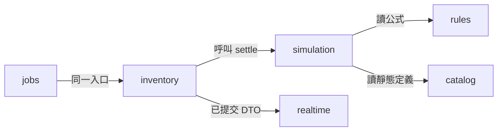
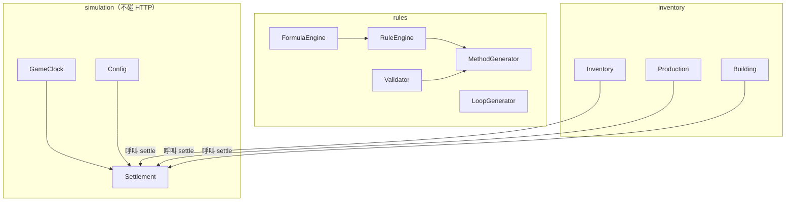

# 《帝國掘起》技術架構總覽

| 項 | 值 |
| --- | --- |
| 版本 | 2026-10-06 |
| 狀態 | **確定**（技術架構總覽） |
| 法源 | [ADR 0001](../adr/0001-tech-stack.md) |
| 規則 | [GDD v2.0 正式全文](../gdd/production-system-v2.md)；分冊 [gdd/README.md](../gdd/README.md) |
| 結算契約 | [time-and-settlement.md](time-and-settlement.md) |
| 模組展開 | [0001-module-boundaries.md](0001-module-boundaries.md) |
| 本階段 | 契約已落地。任務見 [next.md](../next.md) |

本檔對齊《帝國掘起》技術定案與 GDD，**不改** ADR 定案表，**不改** GDD 規則。GDD 的 SQL 與本檔並存時：規則語意聽 GDD；**實作時以 Prisma 對應 PostgreSQL，結算用 `lastSettledAt` + 懶結算**。`simulation` 不碰 HTTP。引擎純計算物件（`GameClock`、`Config`、`Settlement`、`FormulaEngine`、`RuleEngine`、`MethodGenerator`、`LoopGenerator`、`Validator`）與系統（`Inventory`、`Production`、`Building`）對應 NestJS 模組邊界，見第 3–4 節。

GDD `core/` 是純計算物件名。NestJS 模組是部署與 DI 邊界。**禁止再建模組叫 `core`。**

---

## 1. 技術棧摘要（目標）

| 項 | 定案 |
| --- | --- |
| 語言 | TypeScript 全棧 |
| 前端 | React + TypeScript + Vite |
| 地圖 | Phaser 3 **不**進入核心棧 |
| 後端 | Node.js + NestJS |
| 主庫 | PostgreSQL + JSONB + GIN |
| 快取／佇列 | Redis + BullMQ（Redis **不是**主庫） |
| 資料存取 | Prisma + 獨立 `PrismaModule` |
| 即時 | NestJS WebSocket Gateway + Socket.IO |
| 部署 | Docker Compose；雲端不鎖定 |
| 時間 | 1 真實秒 = 60 遊戲秒 = 1 遊戲分鐘；懶結算 |

否決：Fastify 當核心、Phaser 進核心、Redis 當主庫、每 tick 全量模擬、客戶端寫回權威庫存。

MVP／單人期用同一 NestJS 單體，**先不啟用** Redis、BullMQ、Socket.IO。目標棧不得從 ADR 刪除。見 [ADR 0001 分期落地](../adr/0001-tech-stack.md)。

---

## 2. 目錄（已存在）

```
apps/web          React + TypeScript + Vite
apps/api          Node.js + NestJS
  catalog / rules / simulation / inventory
  PrismaModule
  realtime / jobs   （目標；MVP 可不掛載）
packages/shared   共用型別與結算純函數
```

`packages/shared` 不得依賴 Prisma、Socket.IO 或 Redis 客戶端。權威寫入只留在 `apps/api`。

---

## 3. NestJS 模組邊界

| 模組 | 職責 | HTTP | DB 寫 | WS | 結算 |
| --- | --- | --- | --- | --- | --- |
| `auth` | 帳號、JWT、請求上的玩家身分 | 註冊／登入／me | 只寫帳號與 `lastSeenAt` | 否 | 否；進頁仍走 `inventory` |
| `catalog` | 物品、類型、屬性 | 讀 | 否 | 否 | 否 |
| `rules` | 公式、生成、驗證 | GET + validate | 不寫庫存 | 否 | 否 |
| `simulation` | Config、時鐘、懶結算純函數 | 否 | 否 | 否 | 本身 |
| `inventory` | 唯一入帳；`GET /time` | 是 | 是 | 否 | 呼叫 `simulation` |
| `realtime` | 推已提交結果 | 否 | 否 | 是 | 否 |
| `jobs` | BullMQ tick／離線補算 | 否 | 同一入口 | 否 | 同一入口 |
| `PrismaModule` | Prisma | 否 | 供他模 | 否 | 否 |



依賴方向（誰呼叫誰）：`inventory` 與 `jobs` 呼叫 `simulation`；`simulation` 使用 `rules` 的公式與 `catalog` 的靜態定義；`realtime` 不呼叫結算公式。HTTP 控制器不進入 `simulation`。`simulation` **不碰 HTTP**。

MVP：`catalog`／`rules`／`simulation`／`inventory` 要有；`auth` 隨 F1 掛上，不改結算公式。`realtime` 與 `jobs` 可不掛載。

---

## 4. GDD 純計算 ↔ NestJS

| GDD 純計算物件 | NestJS 模組 | 可碰 HTTP／DB／WS |
| --- | --- | --- |
| `GameClock`、`Config`、`Settlement` | `simulation` | 否 |
| `FormulaEngine`、`RuleEngine`、`MethodGenerator`、`LoopGenerator`、`Validator` | `rules` | 否（驗證器可被管理端呼叫，本身不開路由） |
| `systems.Inventory`、`systems.Production`、`systems.Building` | `inventory` | 可碰 HTTP 與 DB；計算仍呼叫 `simulation` / `rules` |
| 物品／類型／屬性靜態資料 | `catalog` | 讀為主 |
| 推送 | `realtime` | 只推已提交結果 |
| 離線補算與粗粒度 tick | `jobs` | 呼叫與 `inventory` 相同的結算入口 |

之後開工：純計算與共用型別放 `packages/shared`，由 `simulation` / `rules` 引用。



箭頭是**呼叫方向**。`simulation` 不依賴 `inventory`，不碰 HTTP／DB／WS。`jobs` 經 `inventory` 同一入帳入口，再呼叫 `Settlement`（見上一張圖）。

---

## 5. 資料與 Prisma

GDD 第 10 節 SQL 是設計約定。實作：

- Prisma schema 對應 PostgreSQL。JSONB + GIN 給 `properties` / 公式 / 隊列。
- `server_state`（世界錨點）與 `game_config`（時間常數）語意分開；Prisma 可合成單列，欄位不得消失。
- `game_config.game_day_game_sec=86400` 為日長語意欄（承接 GDD 原稿 `maxOfflineGameSec`），**不得當入帳 cap**。禁止「硬編碼所以不建欄」而與 GDD SQL 打架。
- 可結算實體同時存 `lastSettledAt`（真實、入帳）與 `last_settled_game`（遊戲秒、顯示）。
- 產品入帳 cap：`maxOfflineRealSec=28800`（系統定義）。GDD 原稿 `maxOfflineGameSec=86400` 保留為日長／原稿常數。

權威儲存在 PostgreSQL。Redis 只做 Session、熱狀態、BullMQ。

---

## 6. 伺服器權威與冪等

- 伺服器唯一權威。前端可用同一純函數預覽，預覽不得寫回。
- `GET /api/v1/time` 只顯示。
- Socket.IO 只推已提交結果。Phaser 若以後做地圖，只讀已結算狀態。
- 同一實體同一已結算真實區間不得雙計。寫入成功才推進 `lastSettledAt` 與 `last_settled_game`。
- `jobs`、NestJS cron、進頁、玩家操作必須走同一個結算入口。

API 清單：[api/v1.md](../api/v1.md)。

---

## 7. 相關文件

| 文件 | 職責 |
| --- | --- |
| [ADR 0001](../adr/0001-tech-stack.md) | 技術棧法源 |
| [ADR 索引](../adr/README.md) | 編號約定（不另建 `0002-production-rules.md`） |
| [ADR 0003](../adr/0003-production-rules.md) | 規則／驗證作為架構約束 |
| [GDD v2.0](../gdd/production-system-v2.md) | 節 1–17 正式全文 |
| [time-and-settlement.md](time-and-settlement.md) | 1:60、懶結算、冪等 |
| [0001-module-boundaries.md](0001-module-boundaries.md) | 不跨層細則 |
| [architecture.md](../architecture.md) | 架構契約正文（模組／懶結算／權威／冪等／離線上限） |
| [系統定義 v1.0](../system-definition.md) | 產品範圍、離線 8 現實小時 |
| [API v1](../api/v1.md) | 端點表 |
| [launch-scope.md](../gdd/launch-scope.md) | 目標首發範圍（不另寫規則） |
| [docs 索引](../README.md) | 閱讀順序與衝突表 |
