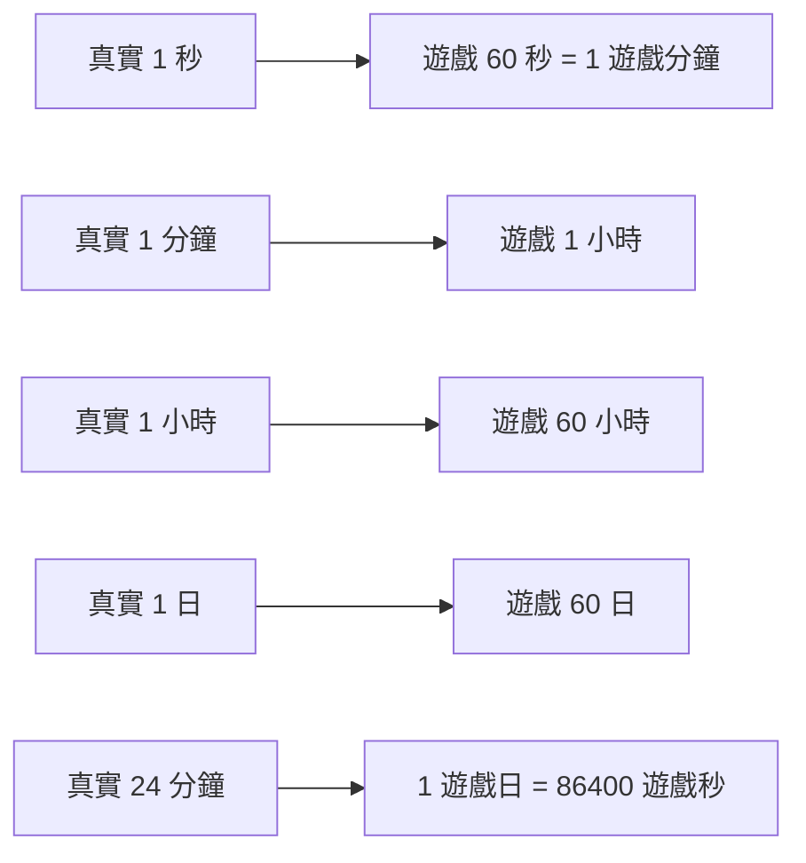
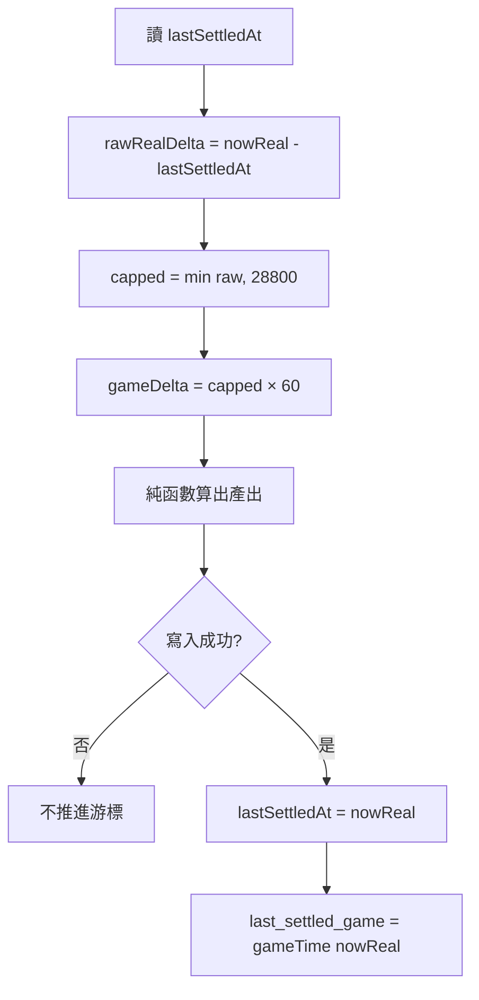
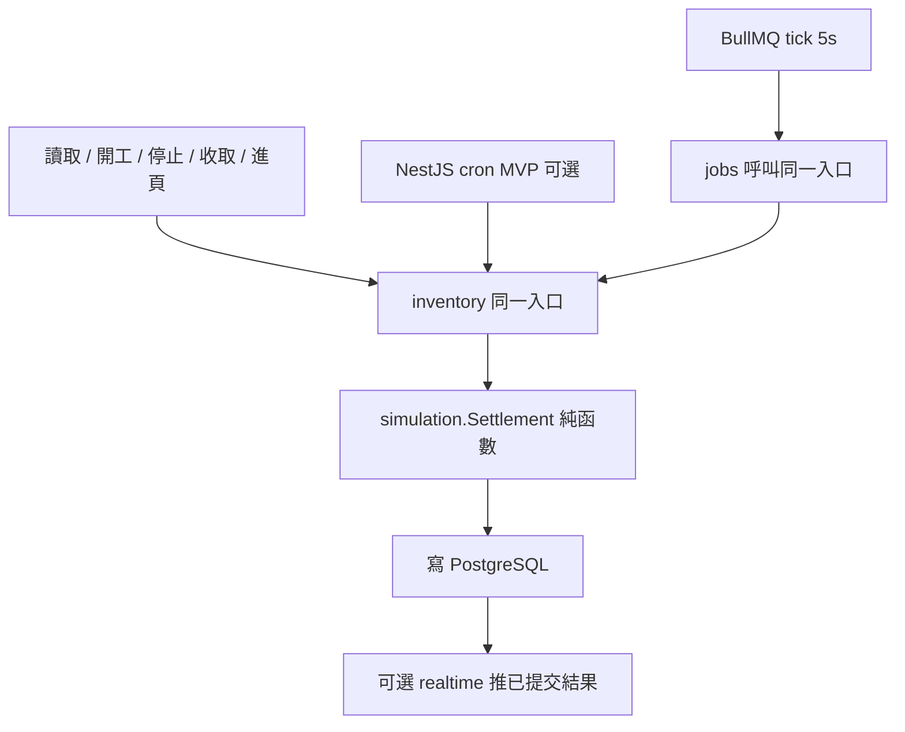
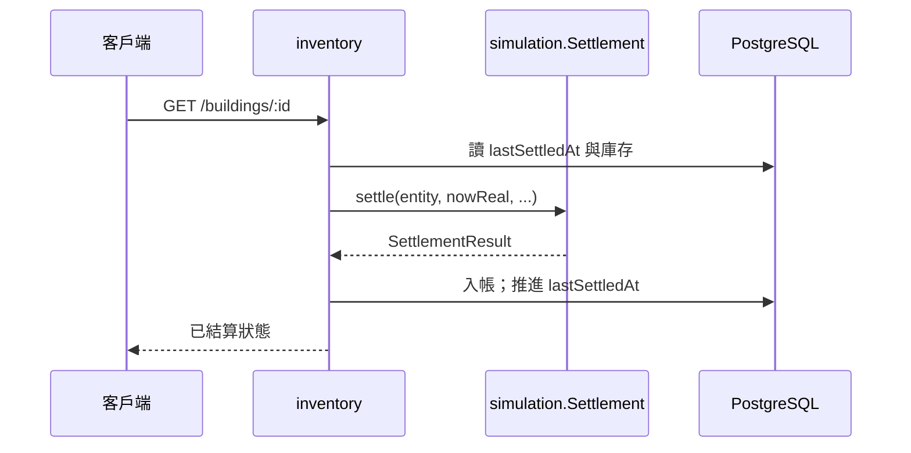

# 《帝國掘起》時間比例與懶結算契約

| 項 | 值 |
| --- | --- |
| 版本 | 2026-10-06 |
| 狀態 | **確定**（結算契約；不改定案） |
| 技術法源 | [ADR 0001](../adr/0001-tech-stack.md) |
| GDD 時間規則 | [GDD v2.0 §2](../gdd/production-system-v2.md#2-時間系統)；[0002](../gdd/0002-time-and-settlement.md) |
| 產品入帳上限 | [系統定義 §5](../system-definition.md)：**8 現實小時** |
| 架構總覽 | [overview.md](overview.md) |

本檔專章寫《帝國掘起》的 **1:60**、懶結算流程、冪等、離線上限、權威狀態。對齊技術定案，**不改** GDD 規則。實作：Prisma 對應 PostgreSQL；結算用 `lastSettledAt` + 懶結算。**不對每座建築每遊戲秒跑迴圈。** `timeScale=60`：**1 真實秒 = 60 遊戲秒 = 1 遊戲分鐘**（真實 1 分鐘 = 遊戲 1 小時，真實 1 日 = 遊戲 60 日）。

---

## 1. 1:60 比例（寫死）

- **1 真實秒 = 60 遊戲秒 = 1 遊戲分鐘**（禁止寫成 61）
- 真實 1 分鐘 = 遊戲 1 小時
- 真實 1 小時 = 遊戲 60 小時
- **遊戲 1 天 = 24 真實分鐘 = 86400 遊戲秒**
- 真實 1 日 = 遊戲 60 日



```
gameTime = startGameTime + (now - startRealTime) / 1000 × timeScale
```

`timeScale = 60`。時間算出來、不存「現在」。世界時鐘只存 `startRealTime`、`startGameTime`、`finishAt`、`lastUpdate`。`GET /api/v1/time` 只供顯示。判定與入帳以伺服器為準。

---

## 2. 兩層數字（禁止混成兩套入帳）

| 層 | 鍵 | 值 | 用途 |
| --- | --- | --- | --- |
| GDD v2.0 原稿 | `timeScale` | `60` | 比例；寫死 |
| GDD v2.0 原稿 | `maxOfflineGameSec` | `86400` | **日長**／原稿常數＝1 遊戲日。必須保留在 GDD |
| GDD v2.0 原稿 | `tickIntervalRealMs` | `5000` | 粗粒度 tick，不是遊戲秒迴圈 |
| 實作日長 | `gameDayGameSec` | `86400` | 承接原稿同值；日曆／顯示；**不是**入帳 cap。`game_config` 語意欄不得消失 |
| 產品入帳（權威） | `maxOfflineRealSec` | `28800` | **8 現實小時**。產能真實差先 cap 此值 |
| 產品入帳（衍生） | `Config.maxOfflineGameSec` | `1728000` | `28800 × 60`＝20 遊戲日 |

GDD 原稿三常數（必須保留在 GDD，86400 **不入帳**）：

```json
{
  "timeScale": 60,
  "maxOfflineGameSec": 86400,
  "tickIntervalRealMs": 5000
}
```

實作 `Config`（入帳 cap 聽系統定義；日長承接原稿 86400）：

```json
{
  "timeScale": 60,
  "gameDayGameSec": 86400,
  "maxOfflineRealSec": 28800,
  "maxOfflineGameSec": 1728000,
  "tickIntervalRealMs": 5000
}
```

實作 `game_config` **只准一列入帳 cap**：`max_offline_real_sec=28800`。GDD 的 86400 不得拿來裁切產能。原稿「28800 遊戲秒」廢棄。

---

## 3. 雙時鐘與 `lastSettledAt`

| 欄位 | 時間種類 | 角色 |
| --- | --- | --- |
| `lastSettledAt` / `last_settled_at` | **真實** | **權威游標**。該時刻以前已入帳 |
| `last_settled_game` | **遊戲秒** | 快照；**不得單獨入帳** |

```
rawRealDeltaSec     = max(0, nowReal - lastSettledAt)
cappedRealDeltaSec  = min(rawRealDeltaSec, maxOfflineRealSec)   // 28800
gameDeltaSec        = cappedRealDeltaSec × 60
```

遊戲時間差 = 裁切後的真實差 × 60。寫入成功後：`lastSettledAt = nowReal`，`last_settled_game = gameTime(nowReal)`（顯示不裁切）。上限外產能為 0，不得再補產。禁止只把游標推進上限秒數留下餘額。

若遊戲快照與由 `lastSettledAt` 推回的值不一致，以真實游標重算。



---

## 4. 懶結算流程

所有渠道都走 **settle**（同一入口）：讀取／操作、BullMQ 粗粒度 tick、上線／離線補算。



渠道：

1. 讀取或操作該實體（MVP **必做**）。
2. 粗粒度 tick（`tickIntervalRealMs=5000`；目標 BullMQ；MVP 可關或用 NestJS 定時器）。
3. 上線／進頁離線補算。

純函數：同輸入同結果。內部不讀系統時鐘、不寫庫、不發網。`nowReal` 由呼叫端注入。可重播、冪等。



---

## 5. 冪等

- 同一實體、同一段已結算真實時間不得重複入帳。
- 只計算 `lastSettledAt` 之後尚未入帳的區間。
- 寫入成功才推進雙時鐘。
- `jobs`／cron／玩家操作不得另寫扣庫公式。

```
settle(entity, nowReal, clock, rules, catalog) → SettlementResult
```

前端可用 `packages/shared` 同一函數預覽；預覽不得寫回。

---

## 6. 離線上限

離線補算**必須有上限**，避免一次掃過無界歷史。

| 解讀 | 採用？ |
| --- | --- |
| 8 現實小時 = 28,800 現實秒 = 1,728,000 遊戲秒 | **入帳採用**（系統定義） |
| GDD 原稿 86400 遊戲秒當日長／原稿紀錄 | **GDD 必須保留** |
| 用 86400／1440 裁切產能 | **禁止** |
| 沒有上限 | **違反 ADR 0001** |

無加速。顯示用 `gameTime` 不因上限凍結。

---

## 7. 禁止

- 每座建築每遊戲秒迴圈
- `1 真實秒 = 61 遊戲秒`
- 只用遊戲欄入帳
- 客戶端寫回權威庫存
- 兩套入帳 cap 同時生效

---

## 8. 權威狀態

伺服器是**單一權威**。PostgreSQL 是權威儲存。

| 來源 | 角色 |
| --- | --- |
| PostgreSQL + `lastSettledAt` | 權威庫存與游標 |
| `simulation.Settlement` 純函數 | 可重播計算；本身不入帳 |
| Socket.IO | 只推**已提交**結果；斷線不影響已入帳 |
| `GET /api/v1/time` | 僅顯示；不結算 |
| 前端預覽 | 同一純函數；**不得寫回** |
| Phaser（若以後做） | 只讀已結算狀態；不進核心棧 |
| Redis | 不是主庫 |

MVP 不用 Socket.IO；進頁 GET 拉權威。

---

## 9. `GET /api/v1/time`

| 項 | 契約 |
| --- | --- |
| 路由模組 | `inventory`（可碰 HTTP） |
| 計算 | 呼叫 `simulation.GameClock`；**禁止**在 `simulation` 開 Controller |
| 回傳 | `startRealTime`、`startGameTime`、`serverRealTime`、`displayGameTime`、`timeScale=60` |
| 不做 | 不結算建築、不改庫存、不推進 `lastSettledAt` |
| 判定 | 僅顯示。入帳仍走建築／庫存 GET 或寫入 API 的懶結算 |

獨立端點表：[api/v1.md](../api/v1.md)。

---

## 10. 相關文件

| 文件 | 職責 |
| --- | --- |
| [ADR 0001](../adr/0001-tech-stack.md) | 技術棧、1:60、懶結算契約 |
| [GDD v2.0 §2](../gdd/production-system-v2.md#2-時間系統) | 時間規則全文 |
| [GDD 0002](../gdd/0002-time-and-settlement.md) | 分冊欄位級 |
| [系統定義 §5](../system-definition.md) | 入帳 8 現實小時 |
| [overview.md](overview.md) | NestJS 模組與 Prisma 對齊 |
| [api/v1.md](../api/v1.md) | `GET /api/v1/time` |
| [architecture.md](../architecture.md) | 架構契約正文 |
| [docs 索引](../README.md) | 閱讀順序與衝突表 |
